# Data Flow Diagram

The following diagram illustrates the data flow in the pyiron-MICRESS workflow.

```mermaid
flowchart LR
    user((👤))
    pyiron[**pyiron<br>Job**]

    subgraph Pre-Processing
        direction LR
        write(Input Wrapper<br>*write_input&lpar;&rpar;*)
    end

    subgraph Processing
        direction LR
        micress[**MICRESS<br>Process**]
    end

    subgraph Post-Processing
        direction LR
        collect(Output Wrapper<br>*collect_output&lpar;&rpar;*)
    end

    user    -- **1.** Simulation Params<br>& MICRESS Template --> pyiron
    pyiron  -- **2.** Input Dict --> write
    write   -- **3.** MICRESS<br>Input File --> micress
    micress -- **4.** MICRESS<br>Output Files --> collect
    collect -- **5.** Output Dict --> pyiron
    pyiron  -- **6.** Simulation<br>Results --> user
```

> If you don't see the diagram, you may need to enable Mermaid support in your Markdown viewer. Alternatively, you can copy the code block into the [Mermaid online editor](https://mermaid.live/) to visualize it.

## Description

The pyiron-MICRESS workflow centers on exchanging structured Python dictionaries between the user, pyiron, and the MICRESS execution layer. The user provides all simulation parameters as a Python dictionary, which also includes a MICRESS input-file template. The `write_input()` pre-processing step merges these parameters with the template and renders a fully formatted MICRESS input file. MICRESS then runs the simulation using this generated input and produces a set of output files. During post-processing, `collect_output()` parses these files and converts the relevant results back into a Python dictionary. Finally, pyiron returns this results dictionary to the user, completing the data flow.
